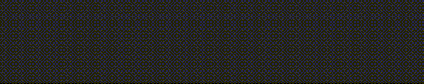

# PatternTextStyle

A styles that process characters laid out in custom patterns of formatting and placeholders.


## Pattern

A collection of characters.

- Its suffix may be hidden with the \\.hidden() method.

## Placeholder

A placeholder reserves a place for another character in a pattern. 

- To replace a placeholder, the replacement character must satisfy its predicate.
- There may be multiple placeholders and each may use independent validation rules.

## Value

A collection of characters. 

- Its size is limited to the number of placeholders in the pattern it tries to fill.

## Examples


```swift
import DiffableTextViews
import SwiftUI

//*============================================================================*
// MARK: View
//*============================================================================*

struct DiffableTextFieldXPhone: View {

    //=------------------------------------------------------------------------=
    // MARK: State
    //=------------------------------------------------------------------------=

    @State var number: String = ""
    @State var style = PatternTextStyle<String>
        .pattern("+## (###) ###-##-##")
        .placeholder("#") { $0.isASCII && $0.isNumber }
        .equals(())
    
    //=------------------------------------------------------------------------=
    // MARK: Body
    //=------------------------------------------------------------------------=
    
    var body: some View {
        DiffableTextField(value: $number, style: style)
            .diffableTextViews_keyboardType(.numberPad)
    }
}
```



```swift
import DiffableTextViews
import SwiftUI

//*============================================================================*
// MARK: View
//*============================================================================*

struct DiffableTextFieldXCard: View {
    
    //=------------------------------------------------------------------------=
    // MARK: State
    //=------------------------------------------------------------------------=
    
    @State var number: String = ""
    @State var style = PatternTextStyle<String>
        .pattern("#### #### #### ####")
        .placeholder("#") { $0.isASCII && $0.isNumber }
        .hidden().equals(())
        
    //=------------------------------------------------------------------------=
    // MARK: State
    //=------------------------------------------------------------------------=
    
    var body: some View {
        DiffableTextField(value: $number, style: style)
            .diffableTextViews_keyboardType(.numberPad)
    }
}
```
