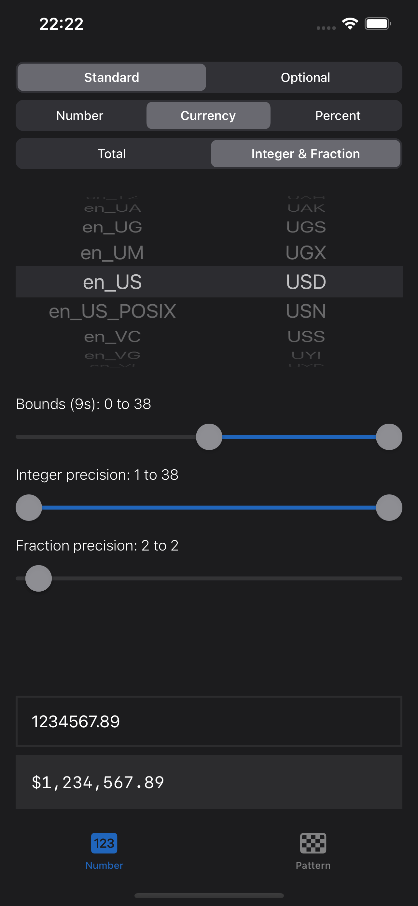
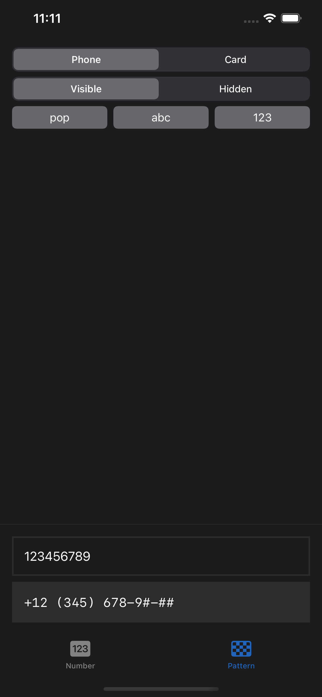

# DiffableTextViews

An open source package for as-you-type formatting in SwiftUI.


### Features

|   | Feature | Description |
|---|:--------|:------------|
| :keyboard: | Responsive | Formats text as you type |
| :magic_wand: | Automagical | Binds text to appropriate types |
| :heavy_check_mark: | Proper | Validates and autocorrects |
| :hammer_and_wrench: | Versatile | Uses snapshots and attributes |
| :running_man: | Performant | O(n) differentiation algorithms |
| :desert_island: | Standalone | Uses no remote dependencies |
| :open_book: | Open | 100% transparent |

# Installation

Simple instructions on how to install this package.

### Swift Package Manager

1. Select https://github.com/oscbyspro/DiffableTextViews
2. Select a **VERSIONED** release

### Import

```swift
import DiffableTextViews
```

### Requirements

| Swift | iOS   | iPadOS | Mac Catalyst | tvOS  |
|:-----:|:-----:|:------:|:------------:|:-----:|
| 5.7+  | 15.0+ | 15.0+  | 15.0+        | 15.0+ |

# Apps

The example app provides quick-and-easy-to-use customization tools.

| Number | Pattern |
|--------|---------|
 | 

### Installation

Download this package and compile/run it with Xcode.

# Views

## DiffableTextField

A text field that binds values and formats them as you type.

### Features

|   | Feature | Description |
|---|:--------|:------------|
| :iphone: | SwiftUI | Value, style, done |
| :mountain: | Environment | Uses environment values |
| :mag_right: | Focus | Supports SwiftUI.FocusState |

### Environment

```swift
environment(\.locale, _:)
environment(\.layoutDirection, _:)
diffableTextViews_autocorrectionDisabled(_:)
diffableTextViews_font(_:)
diffableTextViews_foregroundColor(_:)
diffableTextViews_multilineTextAlignment(_:)
diffableTextViews_onSubmit(_:)
diffableTextViews_submitLabel(_:)
diffableTextViews_textContentType(_:)
diffableTextViews_textFieldStyle(_:)
diffableTextViews_textInputAutocapitalization(_:)
diffableTextViews_tint(_:)
```

# Styles

## NumberTextStyle ([Source](Sources/DiffableTextKitXNumber), [Tests](Tests/DiffableTextKitXNumberTests))

A style that binds localized numbers using various formats.

### Features

|   | Feature | Description |
|---|:--------|:------------|
| :coin: | Values | Decimal, Double, (U)Int(8-64) |
| :grey_question: | Optional | Standard and optional values |
| :art: | Formats | Number, currency and percent |
| :bricks: | Bounds | Clamps values to bounds |
| :bow_and_arrow: | Precision | Up to 38 digits of precision |
| :national_park: | Locales | Supports Foundation.Locale |
| :two: | Bilingual | Accepts local and ASCII input |

### Examples


```swift
import DiffableTextViews
import SwiftUI

//*============================================================================*
// MARK: * Number [...]
//*============================================================================*

struct ContentView: View {
    
    typealias Amount = Decimal // Decimal, Double, (U)Int(8-64), Optional<T>
    
    //=------------------------------------------------------------------------=
    
    @State var amount = 0 as Amount
    @State var currencyCode = "SEK"
    @State var locale = Locale(identifier: "sv_SE")
    
    //=------------------------------------------------------------------------=
    
    var body: some View {
        DiffableTextField(value: $amount) {
            .currency(code: currencyCode)
            // .bounds((0 as Amount)...) // autocorrects while view is in focus
            // .precision(integer: 1..., fraction: 2) // default is appropriate
            // .locale(Locale(identifier: "en_US")).constant() // ignores sv_SE
        }
        .environment(\.locale, locale)
        .diffableTextViews_font(.body.monospaced())
        .diffableTextViews_keyboardType(.decimalPad)
    }
}
```

## PatternTextStyle ([Source](Sources/DiffableTextKitXPattern), [Tests](Tests/DiffableTextKitXPatternTests))

A style that processes characters laid out in custom patterns.

### Features

|   | Feature | Description |
|---|:--------|:------------|
| :checkered_flag: | Pattern | Characters are laid out as described by a pattern | 
| :chess_pawn: | Placeholders | Placeholders represent not-yet-assigned values |
| :fist_raised: | Independance | Supports multiple placeholders with different rules |
| :ghost: | Invisibility | Pattern suffix can easily be \\.hidden() |

### Examples


```swift
import DiffableTextViews
import SwiftUI

//*============================================================================*
// MARK: * Pattern [...]
//*============================================================================*

struct ContentView: View {
    
    typealias Number = String // Array<Character>
    
    //=------------------------------------------------------------------------=
    
    @State var number = Number("123456789")
    
    //=------------------------------------------------------------------------=
    
    var body: some View {
        DiffableTextField(value: $number) {
            .pattern("+## (###) ###-##-##")
            .placeholders("#") { $0.isASCII && $0.isNumber }
            // .hidden(true) // hides pattern beyond last real value
            // .equals(()) // skips comparisons and discards changes
        }
        .diffableTextViews_font(.body.monospaced())
        .diffableTextViews_keyboardType(.numberPad)
    }
}
```

## WrapperTextStyle(s) ([Source](Sources/DiffableTextKit/Styles), [Tests](Tests/DiffableTextKitTests/Styles))

Decorative styles that modify the behavior of their content.

| Style | Description |
|:------|:------------|
| [constant()](Sources/DiffableTextKit/Styles/Constant.swift) | Prevents style transformations |
| [equals(\_:)](Sources/DiffableTextKit/Styles/Equals.swift) | Binds the style's equality to a proxy |
| [standalone()](Sources/DiffableTextKit/Styles/Standalone.swift) | Grants ownership of the style's cache |
| [prefix(_:)](Sources/DiffableTextKit/Styles/Prefix.swift) | Adds a prefix to the style |
| [suffix(_:)](Sources/DiffableTextKit/Styles/Suffix.swift) | Adds a suffix to the style |
