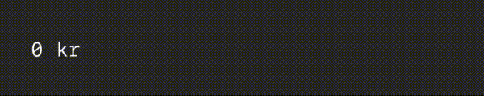
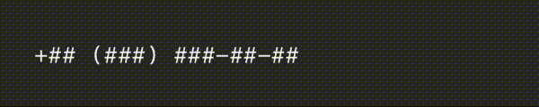
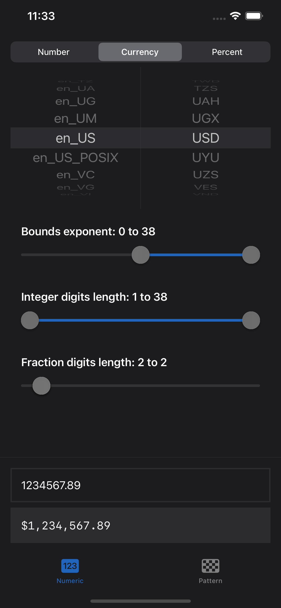

# DiffableTextViews

An open-source module for as-you-type formatting and conversion in iOS.





### Features

|   | Feature | Description |
|---|---------|-------------|
| :keyboard: | Responsive | Formats and parses text as you type |
| :magic_wand: | Automagical | Binds text to its appropriate data type |
| :hammer_and_wrench: | Versatile | Uses snapshots and attributes |
| :running_man: | Performant | O(n) differentiation algorithms |
| :desert_island: | Standalone | Uses no remote dependencies |
| :window: | Open source | Transparent, as it should be |
| :smiley: | Emojis | Naitive offsets, supports emojis |

### [Algorithms](Sources/DiffableTextViews/Models/Field.swift)

It uses three main algorithms to determine text selection.

|   | Algorithm | Description | Complexity |
|---|-----------|-------------|------------|
| :book: | Text | Determines selection when text changes | ≤ Linear |
| :left_right_arrow: | Positions | Determines selection by positions/offsets | ≤ Linear |
| :star: | Attributes | Determines selection based on attributes | ≤ Linaer |

### Requirements

- iOS 15.0+
- Swift 5.0+

### Installation

1. Use: Swift Package Manager.
2. Copy/paste: https://github.com/oscbyspro/DiffableTextViews.
3. Select a **VERSIONED** branch.

```swift
import DiffableTextViews
import NumericTextStyles
import PatternTextStyles
```

# [Examples](Examples/iOS/App)

👷‍♂️🛠🚧🚧🧱🏗🧱🚧🚧⏳

The iOS example project provides quick-and-easy-to-use configuration.



### Modules

It uses custom made [interval sliders](Examples/iOS/Modules/IntervalSliders/Sources/IntervalSliders), written in SwiftUI.

### Instructions

To try it, download this package and run the example project from its location.

# Views

## [DiffableTextField](Notes/DiffableTextField.md)

A view that uses styles to format and parse text.

### Features

|   | Feature | Description |
|---|---------|-------------|
| :iphone: | SwiftUI | Value, style, done |
| :mountain: | Environment | Uses environment values |
| :balance_scale: | Monospaced | The standard font is monospaced |
| :sewing_needle: | Customizable | Styles may provide default values |

### ProxyTextField

A customization point for the UITextField it is based on.

# Styles

## [NumericTextStyle](Notes/NumericTextStyle.md)

A style that processes localized numbers in various formats.

### Features

|   | Feature | Description |
|---|---------|-------------|
| :coin: | Values | Decimal, Float(16-64) and (U)Int(8-64) |
| :bow_and_arrow: | Precision | Up to 38 significant digits |
| :bricks: | Bounds | Clamps input/output to specified range |
| :art: | Formats | Number, currency and percent |
| :national_park: | Locales | Supports every locale in Foundation |
| :two: | Bilingual | Accepts both local and ASCII inputs |

### Examples


```swift
struct DiffableAmountTextField: View {
    @State var amount: Decimal = 0

    var body: some View {
        DiffableTextField($amount) {
            .currency(code: "SEK")
            .bounds((0 as Decimal)...)
            .precision(integer: 1..., fraction: 2)
        }
        .environment(\.locale, Locale(identifier: "en_SE"))
    }
}
```

## [PatternTextStyle](Notes/PatternTextStyle.md)

A style that processes characters laid out in custom patterns.

### Features

|   | Feature | Description |
|---|---------|-------------|
| :checkered_flag: | Pattern | Characters are laid out as described by a pattern | 
| :chess_pawn: | Placeholders | Placeholders represent not-yet-assigned values |
| :fist_raised: | Independance | Supports multiple placeholders with different rules |
| :ghost: | Invisibility | Pattern suffix can easily be \\.hidden() |

### Examples


```swift
struct DiffablePhoneNumberTextField: View {
    @State var phoneNumber: String = ""
    
    var body: some View {
        DiffableTextField($phoneNumber) {
            .pattern("+## (###) ###-##-##")
            .placeholder("#") { $0.isASCII && $0.isNumber }
            .constant()
        }
        .diffableTextField_onSetup({ $0.keyboard(.phonePad) })
    }
}
```
