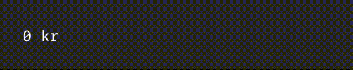
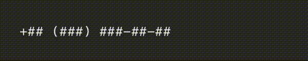
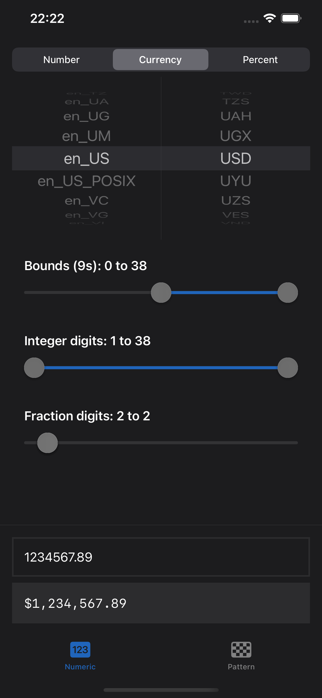
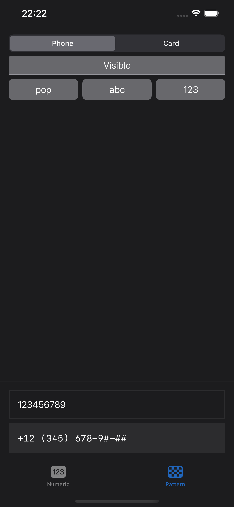

# DiffableTextViews

An open source package for as-you-type formatting in SwiftUI.





### Features

|   | Feature | Description |
|---|---------|-------------|
| :keyboard: | Responsive | Formats and parses text as you type |
| :magic_wand: | Automagical | Binds text to its appropriate data type |
| :hammer_and_wrench: | Versatile | Uses snapshots and attributes |
| :running_man: | Performant | Uses O(n) differentiation algorithms |
| :smiley: | Emojis | Uses native offsets, supports emojis |
| :desert_island: | Standalone | Uses no remote dependencies |
| :open_book: | Open source | 100% transparent, as it should be |

### [Algorithms](Sources/DiffableTextKit/Models)

It uses three main algorithms to determine text selection.

|   | Algorithm | Description | Complexity |
|---|-----------|-------------|------------|
| :book: | Text | Determines selection when text changes | ≤ Linear |
| :left_right_arrow: | Positions | Determines selection by positions/offsets | ≤ Linear |
| :star: | Attributes | Determines selection based on attributes | ≤ Linaer |

### Requirements

- iOS 15.0+
- Swift 5.0+

### Installation

1. Use: Swift Package Manager.
2. Copy/paste: https://github.com/oscbyspro/DiffableTextViews.
3. Select a **VERSIONED** release.

```swift
import DiffableTextViews
```

# [Examples](Examples/iOS/App)

The iOS example provides quick-and-easy-to-use customization tools.

| Numeric | Pattern |
|---------|---------|
 | 

### Installation

Download this package and compile/run it with Xcode.

# Views

## [DiffableTextField](Notes/DiffableTextField.md)

A text field that binds values and formats them as you type.

### Features

|   | Feature | Description |
|---|---------|-------------|
| :iphone: | SwiftUI | Value, style, done |
| :mountain: | Environment | Uses environment values |
| :balance_scale: | Monospaced | Standard font is monospaced |
| :sewing_needle: | Customizable | Customized using [ProxyTextField](Sources/DiffableTextKitXUIKit/Views/ProxyTextField.swift) |
| :bulb: | Smart | Styles may provide sensible defaults |

# Styles

## [NumericTextStyle](Notes/NumericTextStyle.md) ([Source](Sources/DiffableTextStylesXNumeric), [Tests](Tests/DiffableTextStylesXNumericTests))

A style that binds localized numbers using various formats.

### Features

|   | Feature | Description |
|---|---------|-------------|
| :coin: | Values | Decimal, Double and (U)Int(8-64) |
| :bow_and_arrow: | Precision | Up to 38 digits of precision |
| :bricks: | Bounds | Clamps values to a closed range  |
| :art: | Formats | Number, currency and percent |
| :national_park: | Locales | Supports every locale in Foundation |
| :two: | Bilingual | Accepts both local and ASCII inputs |

### Examples


```swift
struct DiffableTextFieldXAmount: View {

    //=------------------------------------------------------------------------=
    // MARK: State
    //=------------------------------------------------------------------------=

    @State var amount: Decimal = 0

    //=------------------------------------------------------------------------=
    // MARK: Body
    //=------------------------------------------------------------------------=

    /// default precision is chosen based on currency
    var body: some View {
        DiffableTextField($amount) {
            .currency(code: "SEK")
            .bounds((0 as Decimal)...)
            // .precision(integer: 1..., fraction: 2)
        }
        .environment(\.locale, Locale(identifier: "sv_SE"))
    }
}
```

## [PatternTextStyle](Notes/PatternTextStyle.md) ([Source](Sources/DiffableTextStylesXPattern), [Tests](Tests/DiffableTextStylesXPatternTests))

A style that processes characters laid out in custom patterns.

### Features

|   | Feature | Description |
|---|---------|-------------|
| :checkered_flag: | Pattern | Characters are laid out as described by a pattern | 
| :chess_pawn: | Placeholders | Placeholders represent not-yet-assigned values |
| :fist_raised: | Independance | Supports multiple placeholders with different rules |
| :ghost: | Invisibility | Pattern suffix can easily be \\.hidden() |

### Examples


```swift
struct DiffableTextFieldXPhone: View {

    //=------------------------------------------------------------------------=
    // MARK: State
    //=------------------------------------------------------------------------=

    @State var number: String = ""
    
    //=------------------------------------------------------------------------=
    // MARK: Body
    //=------------------------------------------------------------------------=
    
    var body: some View {
        DiffableTextField($number, style: Self.style)
            .onSetup(of: .diffableTextField) { 
                $0.keyboard.view(.numberPad)
            }
    }
    
    //=------------------------------------------------------------------------=
    // MARK: Style
    //=------------------------------------------------------------------------=
    
    static let style = PatternTextStyle<String>
        .pattern("+## (###) ###-##-##")
        .placeholder("#") { $0.isASCII && $0.isNumber }
        .equals(())
}
```
